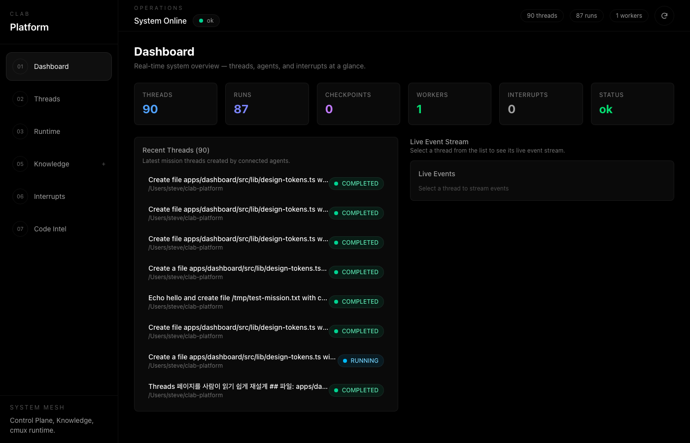
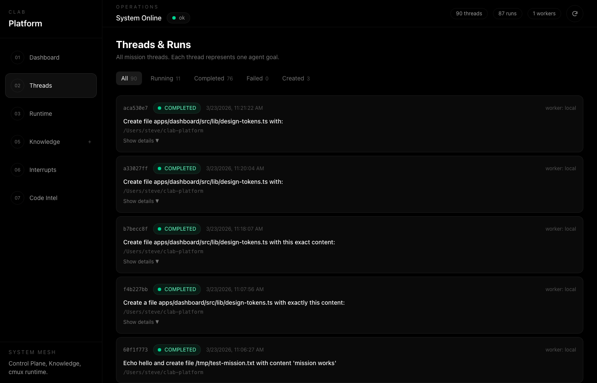
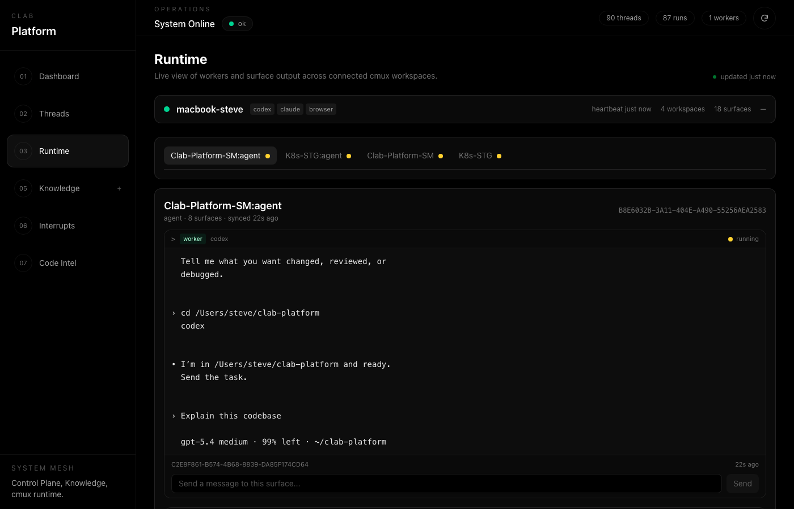
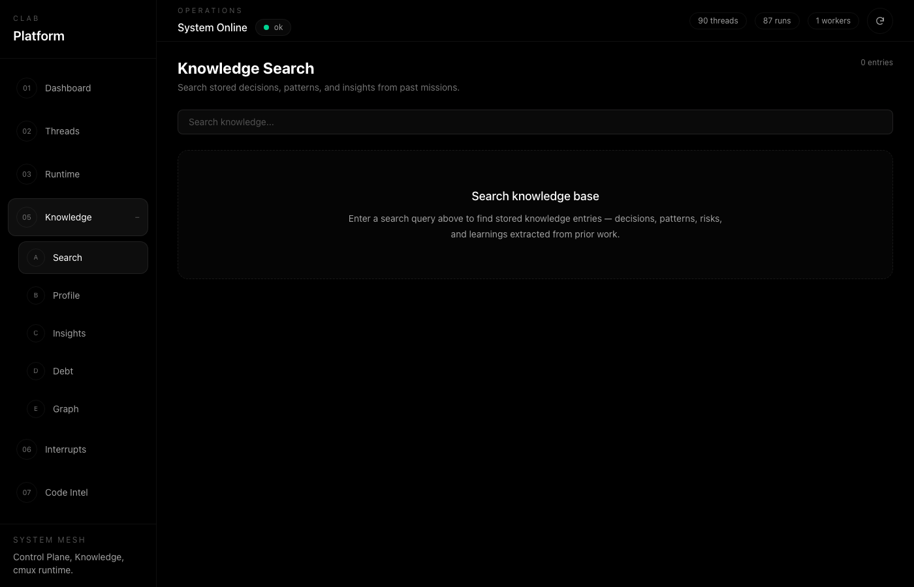
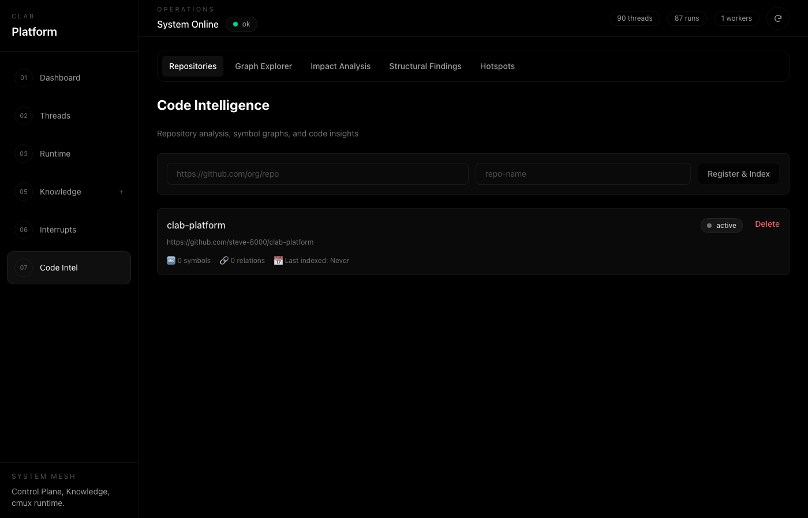
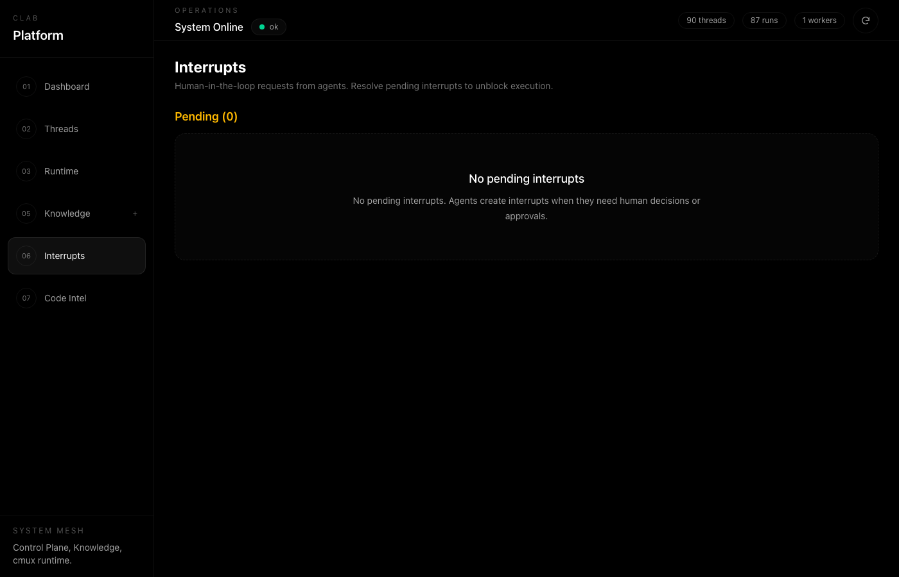

# clab-platform

**Multi-agent orchestration platform for autonomous software development.**

Give it a goal. It plans, executes in parallel, reviews, and delivers — with full state tracking, knowledge integration, and human-in-the-loop support.

> Live demo: [ai.clab.one](https://ai.clab.one)



## What It Does

You describe what you want built. clab-platform:

1. **Plans** — decomposes your goal into executable tasks
2. **Executes** — runs tasks in parallel across 3 codex workers
3. **Reviews** — each result goes through automated code review (approve/fix loop)
4. **Learns** — stores decisions, patterns, and insights for future runs
5. **Reports** — real-time dashboard with threads, events, and interrupt handling

All of this happens autonomously. You can watch, intervene via interrupts, or just wait for the result.

## Screenshots

| Dashboard | Threads | Runtime |
|-----------|---------|---------|
|  |  |  |

| Knowledge | Code Intelligence | Interrupts |
|-----------|------------------|------------|
|  |  |  |

## Architecture

Three-layer design: K8s services for state + knowledge, local runtime for execution.

```
Control Plane (K8s, FastAPI)        Knowledge Plane (K8s, Go)
  Threads, runs, checkpoints          Pre-K / Post-K lifecycle
  Human-in-the-loop interrupts        Knowledge search & storage
  SSE streaming to dashboards         Insight extraction

cmux Runtime Plane (Local)
  LangGraph StateGraph agent
  4 codex surfaces in one workspace:
    codex-0 (main) = planner + reviewer
    codex-1/2/3   = parallel workers
  Notification-based completion monitoring
```

## Quick Start

```bash
git clone https://github.com/steve-8000/clab-platform.git
cd clab-platform
bash setup.sh
```

This installs dependencies, creates `.env`, and registers MCP tools.

### Prerequisites

- Python 3.11+
- Node.js 18+ (dashboard)
- [Claude Code CLI](https://github.com/anthropics/claude-code) or [Codex CLI](https://github.com/openai/codex) (at least one)
- [cmux](https://cmux.dev) (for parallel execution)
- Docker + Kubernetes (optional, for K8s deployment)

### Option A: MCP Tool (recommended)

Use from any project via Claude Code or Codex:

```bash
# Initialize clab in your project
bin/clab-init

# Start Claude Code or Codex
claude   # or: codex

# Then use MCP tools:
# mission_run, knowledge_search, knowledge_store, platform_health, etc.
```

### Option B: Direct CLI

```bash
cd local-agent && source .venv/bin/activate
python -m local_agent --parallel --workdir ~/my-project "implement user auth with JWT"
```

### Option C: K8s Deployment

```bash
cp .env.example .env          # Edit API keys
bin/build-images.sh            # Build Docker images
kubectl apply -f k8s/          # Deploy stack
bin/port-forward.sh            # Local access
```

## How It Works

```
User Goal
  |
  v
Pre-K: retrieve prior knowledge
  |
  v
Planner (codex-0 on main surface): decompose into task graph
  |
  v
Execute (parallel):
  codex-1/2/3 work concurrently
  codex-0 reviews each result (APPROVED / FIX)
  Fix loop: max 2 rounds, then accept
  |
  v
Verifier: test/lint/typecheck
  |
  v
Replanner: on failure, re-decompose and retry
  |
  v
Post-K: verify knowledge integrity
  |
  v
Store insights for future runs
```

### Workspace Model

```
Orchestrator Workspace (your terminal):
  Claude CLI or Codex CLI — orchestration only

Agent Workspace "{orchestrator}:agent" (e.g. "K8s-STG:agent"):
  codex-0 (main)  = planner + reviewer
  codex-1 (right) = worker
  codex-2 (down)  = worker
  codex-3 (down)  = worker
```

- Workspace persists across missions — codex retains context
- Named `{orchestrator}:agent` for deterministic lookup
- Auto-detected via `CMUX_WORKSPACE_ID` environment variable
- Pinned to prevent terminal title override

### Task Contract

- Each task is independently executable by a CLI tool
- Workers can run tasks in isolation without hidden dependencies
- Task descriptions include all context needed for execution

## Components

| Component | Language | Path |
|-----------|----------|------|
| Control Plane | Python (FastAPI) | `control-plane/` |
| Knowledge Server | Go (chi) | `knowledge-server/` |
| Knowledge Library | Python | `knowledge/` |
| Local Agent | Python (LangGraph) | `local-agent/` |
| cmux Runtime | Python | `local-agent/local_agent/cmux/` |
| Dashboard | Next.js | `apps/dashboard/` |
| Code Intelligence | Python (FastAPI) | `apps/code-intel/` |
| CodeGraph Adapter | Python | `packages/codegraph/` |
| MCP Server | Python | `mcp-server/` |

## MCP Tools

Available via `mcp-server/server.py` — works with both Claude Code and Codex:

| Tool | Description |
|------|-------------|
| `mission_run` | Run full development mission (parallel by default) |
| `knowledge_pre_k` | Retrieve prior knowledge before starting work |
| `knowledge_post_k` | Verify knowledge integrity after work |
| `knowledge_search` | Search knowledge base |
| `knowledge_store` | Store decisions, patterns, insights |
| `platform_health` | Check service health |
| `session_list` | List agent sessions |
| `interrupt_list` / `interrupt_resolve` | Human-in-the-loop |

## Codex Prompting

When dispatching work to codex agents:

- Direct inline instructions preferred over prompt file references
- Preamble: `"Do not produce a task list or plan. Execute now."`
- Max 4 edits per prompt (more triggers planning mode)
- End with: `"Modify files directly. Do not summarize or plan."`

## Notification Protocol

```bash
cmux clear-notifications          # 1. Clear stale
cmux send --surface $S "$CMD"     # 2. Inject command
sleep 15                          # 3. Wait for codex startup
cmux clear-notifications          # 4. Clear startup noise
# 5. Poll by surface_id (field 3), not by status
for i in $(seq 1 120); do
  sleep 4
  cmux list-notifications | grep -q "$SURFACE_UUID" && break
done
```

## Production Features

- **Checkpointer** — remote checkpoint storage via Control Plane
- **Human-in-the-loop** — interrupt/resume via `/interrupts` API
- **SSE Streaming** — WebSocket to SSE event streaming
- **Retry/Replanning** — LangGraph RetryPolicy + LLM replanning
- **Long-running Resume** — thread_id based checkpoint recovery
- **Parallel Execution** — 4-surface codex WorkerPool with review loop
- **Idle Detection** — TUI prompt detection instead of blind sleep
- **Notification Filtering** — surface_id based, status-agnostic
- **Workspace Reuse** — codex sessions persist across missions

## Tech Stack

| Layer | Technology |
|-------|-----------|
| Agent Framework | LangGraph + LangChain |
| LLM | Claude (Anthropic) / GPT (OpenAI) |
| Control Plane | FastAPI + WebSocket + SSE |
| Knowledge Server | Go + chi router |
| CLI Execution | Codex CLI (primary) + Claude Code CLI (fallback) |
| Runtime | cmux (workspace/surface multiplexer) |
| Dashboard | Next.js 15 + Tailwind CSS |
| Container | Docker |
| Orchestration | Kubernetes + ArgoCD (GitOps) |
| Database | PostgreSQL |

## License

MIT
