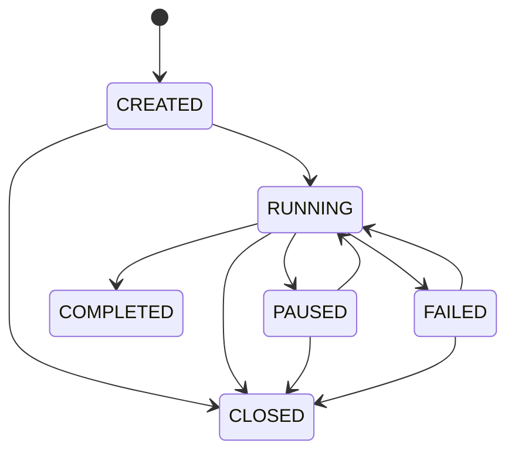
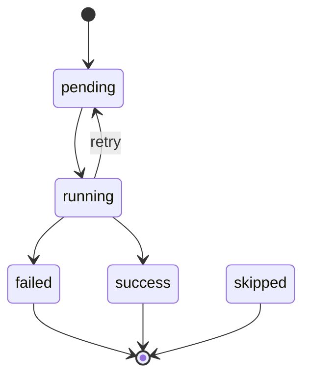
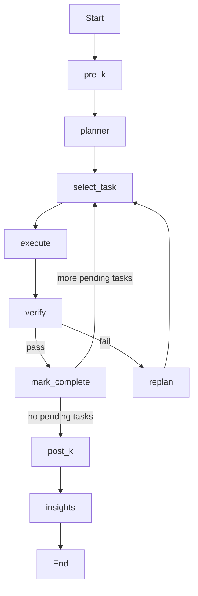

# Phase 0: clab-platform Structure Analysis

## Executive Summary

clab-platform is a multi-agent orchestration platform organized around three planes: a Control Plane for session and interrupt management, a Knowledge Plane for retrieval and integrity checks, and a local cmux-based runtime for agent execution.
The repository is split into 2 apps, 4 service-style runtimes, and 2 package/library areas, with Kubernetes manifests under `k8s/` for deployment.
At a high level, the core workflow is: goal intake -> Pre-K retrieval -> planning -> parallel execution via cmux workers -> verification -> replanning on failure -> Post-K and insight capture.
The execution model separates orchestration from implementation by keeping the orchestrator context clean while running agent work inside dedicated cmux workspaces and surfaces.
In practice, this becomes a two-workspace mental model: an orchestrator workspace for coordination and utility tasks, and an agent workspace that hosts Codex workers, Claude review, and optional browser execution.
The control-plane is Python/FastAPI oriented, the knowledge-server is Go with `chi`, the dashboard is Next.js, the local agent is built with LangGraph, and cmux provides the terminal/surface execution substrate.
The result is a system that can plan work, run it concurrently, review and repair outputs, and persist reusable knowledge for later runs.

## Component Inventory

The repo is centered on a small number of top-level runtime components plus supporting libraries:

- Apps
  - `apps/dashboard`: Next.js operator dashboard for health, threads, interrupts, and live event streaming
  - `apps/code-intel`: secondary app area for code intelligence workflows
- Services / runtimes
  - `control-plane`: session state, checkpoints, interrupts, and worker coordination APIs
  - `knowledge-server`: Go HTTP service for knowledge CRUD, Pre-K, Post-K, and insight extraction
  - `local-agent`: LangGraph-driven agent runtime with planner, executor, verifier, and replanner nodes
  - `mcp-server`: MCP bridge exposing control-plane and knowledge operations to Codex/Claude clients
- Packages / libraries
  - `knowledge`: shared Python knowledge library and LangGraph-facing tools
  - `packages/codegraph`: packaged codegraph support used by the wider platform
- Deployment
  - `k8s`: Kubernetes manifests for running the platform as a multi-service deployment

At a system level, the dashboard and MCP layer are the operator/client entry points, the control-plane and knowledge-server are long-lived backend services, and the local-agent is the execution engine that turns goals into task runs.

## Task Lifecycle

This project has two related lifecycles:

- The control-plane session lifecycle tracks the overall run.
- The local-agent task lifecycle tracks each planned task inside that session.

### 1. Session State Machine

`control-plane/state.py` defines the allowed session transitions:



Valid transitions:

- `CREATED -> RUNNING`, `CREATED -> CLOSED`
- `RUNNING -> PAUSED`, `RUNNING -> COMPLETED`, `RUNNING -> FAILED`, `RUNNING -> CLOSED`
- `PAUSED -> RUNNING`, `PAUSED -> CLOSED`
- `FAILED -> RUNNING`, `FAILED -> CLOSED`
- `COMPLETED` and `CLOSED` are terminal

Operationally, a session is created first, enters `RUNNING` when execution begins, may pause/resume, and eventually ends as `COMPLETED`, `FAILED`, or `CLOSED`.

### 2. Task State Machine

`local-agent/graph/state.py` defines each `TaskItem` with `status` in:

- `pending`
- `running`
- `success`
- `failed`
- `skipped`

Typical task flow:



Execution semantics:

- Planner initializes all tasks as `pending` with `attempt = 0`.
- Executor marks the selected task `running` and increments `attempt`.
- Verifier decides whether execution is accepted.
- On pass, `mark_complete` promotes the task to `success`.
- On failure, `replanner` chooses one of:
  - `retry`: put the task back to `pending` with a modified description
  - `skip`: mark the task `failed` and advance
  - `abort`: mark the current and remaining tasks `skipped`

Retry logic:

- `attempt` increments when execution starts, not when verification finishes.
- `max_retries` is enforced in `replanner.py`.
- If `attempt >= max_retries`, the task is marked `failed` and the graph advances to the next task without another retry.

### 3. Agent Graph Flow

The LangGraph flow is defined in `local-agent/graph/builder.py`:

```text
START
  -> pre_k
  -> planner
  -> select_task
  -> executor
  -> verifier
     -> mark_complete -> select_task ... -> post_k -> insights -> END
     -> replanner -> select_task ...
```

More explicitly:



Node roles:

- `pre_k`: retrieves prior knowledge and project-doc context, then stores it in `enriched_context` / `pre_k_result`
- `planner`: decomposes the goal into executable `TaskItem`s
- `select_task`: picks the next `pending` task and increments `iteration_count`
- `executor`: runs the task via cmux if available, otherwise CLI subprocess fallback
- `verifier`: runs `ruff`, `mypy`, and `pytest` as subprocesses; it never runs inside cmux surfaces
- `replanner`: decides `retry`, `skip`, or `abort` after execution/verification failure
- `post_k`: checks modified markdown docs for knowledge integrity
- `insights`: extracts reusable learnings after the run

Knowledge integration points:

- `pre-K` is an entry hook before planning, so planning and execution can use prior patterns and related docs.
- `post-K` runs only after task execution is done, primarily to validate modified docs.
- Insight extraction is the final knowledge write-back step after `post-K`.

### 4. cmux Execution Model

`local-agent/local_agent/cmux/executor.py`, `worker.py`, and `monitor.py` implement the local execution runtime.

Core lifecycle:

```text
workspace creation
  -> surface allocation
  -> engine start
  -> command injection
  -> output monitoring
  -> completion trigger
  -> graph verification / replanning
```

Detailed runtime flow:

1. Workspace creation
   `CmuxRuntime.create_agent()` creates or reuses a cmux workspace for the agent run.
2. Surface allocation
   `get_or_create_surface()` allocates one reusable surface per engine (`codex`, `claude`, `browser`).
3. Engine bootstrap
   `start_engine()` does `cd <workdir>` and launches the CLI in that surface.
4. Command injection
   `inject_command()` sends the task instruction and presses Enter.
   Long prompts are written to `.clab/prompts/*.md` first to avoid TUI truncation.
5. Idle / completion detection
   `CompletionMonitor.wait_for_completion()` is notification-first, with idle-pattern and unchanged-output fallback.
   Known permission prompts are auto-accepted to keep workers autonomous.
6. Completion signaling
   `signal_completion()` emits a cmux notification that the task appears done.
   This is only a trigger, not the source of truth.
7. Task result handoff
   Runtime returns raw output plus `idle_detected`; the graph verifier/replanner decides actual success vs failure.

Important distinction:

- cmux decides that an engine looks idle or sent a completion notification
- the LangGraph state machine decides whether the task actually succeeded

### 5. Parallel Execution Mode

Parallel execution is modeled in `AgentState` with:

- `parallel_mode: bool`
- `batch_results: list[dict]`

The parallel graph uses `build_parallel_agent_graph()` and replaces single-task execution with:

- `select_batch_node()`
- `parallel_executor_node()`
- `mark_batch_complete_node()`

Execution model:

- Up to 3 `pending` tasks are selected per cycle.
- `CmuxRuntime.create_worker_pool()` provisions 3 Codex worker surfaces plus 1 Claude reviewer surface.
- `WorkerPool.execute_batch()` runs tasks concurrently across codex workers.
- Each task result may go through the Claude review/fix loop before being returned.
- Successful batch verification promotes all `running` tasks in the batch to `success`.

cmux worker flow:

```text
workspace
  -> codex-worker-0
  -> codex-worker-1
  -> codex-worker-2
  -> claude-reviewer
```

Current state-field note:

- `parallel_mode` and `batch_results` exist in `AgentState` as the batch-execution schema.
- In the current implementation, the main control flow relies more heavily on `plan`, `current_task_index`, `surface_map`, and per-task `status`.
- `batch_results` is a reserved container for batched metadata, but it is not yet a central control field in the executor/builder logic.

## Review Flow & Knowledge Integration

- Verification flow
  - Execution runs before verification. [`local-agent/graph/verifier.py`](/Users/steve/clab-platform/local-agent/graph/verifier.py) first checks `current_exit_code`.
  - If execution already failed, verification fails immediately and returns `verification_passed=False`.
  - If execution succeeded, verifier runs `ruff`, `mypy`, and `pytest` as subprocesses in the project workdir, with a 60 second timeout per check.
  - Each check is classified as `PASS`, `FAIL`, or `SKIP`; missing tools and `pytest` with no collected tests are treated as skip.
  - Verification passes only when there are zero failed checks. The node writes back `verification_result` and `verification_passed`.
  - [`local-agent/graph/replanner.py`](/Users/steve/clab-platform/local-agent/graph/replanner.py) handles failure after execution or verification.
  - Replanner receives the original plan, failed task, task output, and verification result, then chooses `retry`, `skip`, or `abort`.
  - `retry` rewrites the task description and requeues the task. `skip` marks the task failed and advances. `abort` skips the remaining plan.
  - Retries are capped by `max_retries`; once exceeded, the task is marked failed and the graph moves on.

- cmux review loop
  - [`local-agent/local_agent/cmux/worker.py`](/Users/steve/clab-platform/local-agent/local_agent/cmux/worker.py) creates a `WorkerPool` with 3 Codex workers and 1 Claude reviewer surface.
  - Codex workers execute tasks in parallel batches. Each completed task result can enter `ReviewLoop`.
  - Review is serialized with a lock because all tasks share one Claude reviewer surface.
  - Reviewer output is binary by contract: exact `APPROVED` or `FIX: <specific instructions>`.
  - On `FIX`, the feedback is injected back into the same Codex worker, and the updated output is re-reviewed.
  - The review loop allows at most 2 fix rounds (`MAX_FIX_ROUNDS = 2`). If approval still does not arrive, the result is accepted as-is and execution continues.

## Dashboard UI

Current implementation in `apps/dashboard` is a compact Next.js App Router UI with one shared shell, four implemented secondary routes, dashboard widgets, and a small hook/API layer. The requested `missions` route and `components/missions`, `components/agents`, and `components/knowledge` feature directories are not present in the current checkout, so the inventory below reflects the actual tree.

### Page Structure

- `/` (`apps/dashboard/src/app/page.tsx`): main dashboard page with health/stat cards, recent threads, live event stream for a selected thread, and pending interrupt summary.
- `/agents` (`apps/dashboard/src/app/agents/page.tsx`): shows registered workers from the control plane and a placeholder section for cmux workspaces.
- `/threads` (`apps/dashboard/src/app/threads/page.tsx`): lists thread/run records with status, goal, workdir, timestamps, and worker metadata.
- `/interrupts` (`apps/dashboard/src/app/interrupts/page.tsx`): shows pending and resolved interrupts and provides inline resolution for pending items.
- `/knowledge` (`apps/dashboard/src/app/knowledge/page.tsx`): provides debounced knowledge search plus a lightweight total-entry status indicator.
- Root shell (`apps/dashboard/src/app/layout.tsx`): applies global styles and wraps all pages with the fixed sidebar and sticky top header.

### Component Hierarchy

```text
RootLayout
├─ Sidebar
├─ Header
└─ Route Page
   ├─ DashboardPage
   │  ├─ StatCards
   │  ├─ Recent Threads list
   │  │  └─ StatusBadge
   │  ├─ LiveEvents
   │  └─ Pending Interrupts list
   │     └─ StatusBadge
   ├─ AgentsPage
   │  ├─ Worker cards
   │  │  └─ StatusBadge
   │  └─ EmptyState
   ├─ ThreadsPage
   │  ├─ Skeleton
   │  ├─ Thread cards
   │  │  └─ StatusBadge
   │  └─ EmptyState
   ├─ InterruptsPage
   │  ├─ Pending interrupt cards
   │  │  └─ StatusBadge
   │  ├─ Resolved interrupt cards
   │  │  └─ StatusBadge
   │  └─ EmptyState
   └─ KnowledgePage
      ├─ Search input
      ├─ Knowledge result cards
      └─ EmptyState
```

Shared primitives in `apps/dashboard/src/components/ui` are intentionally thin:

- `status-badge.tsx`: status-to-color mapping for thread/run, interrupt, session, and cmux states.
- `skeleton.tsx`: generic loading placeholder and card skeleton.
- `empty-state.tsx`: reusable empty-state block for no-data views.

### Data Flow

- Route components call hooks from `apps/dashboard/src/hooks`.
- `use-control-plane.ts` polls the control plane through the `cp` client in `apps/dashboard/src/lib/api.ts` for health, threads, interrupts, and interrupt resolution.
- `use-knowledge.ts` debounces the search query and calls the `ks` client for knowledge search and status.
- `apps/dashboard/src/lib/config.ts` points frontend requests at `/api/cp` and `/api/ks` by default, with `NEXT_PUBLIC_CONTROL_URL` and `NEXT_PUBLIC_KNOWLEDGE_URL` overrides for local development.
- `apps/dashboard/src/types/index.ts` defines the frontend contracts for threads, runs, events, interrupts, workers, artifacts, health payloads, knowledge entries, and cmux workspace models.

### Real-Time Updates Via SSE

- `use-sse.ts` creates an `EventSource` for `/threads/{threadId}/events` on the control plane.
- `LiveEvents` consumes that hook and renders the rolling event feed for the currently selected thread, capped to the latest 100 events.
- The rest of the dashboard still uses interval polling: health refreshes every 10 seconds, threads and interrupts every 5 seconds, and knowledge status every 30 seconds.
